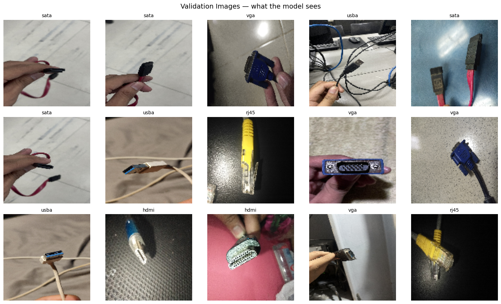
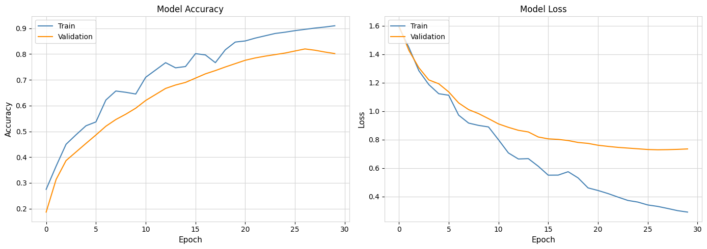

# Interface Recognition - CNN Connector Classifier

A small CNN that looks at a close-up photo of a cable or port and says which of
five interface types it is: HDMI, RJ45, SATA, USB-A, or VGA. Supervised image
classification, trained end-to-end nothing pretrained, nothing scraped. The
whole dataset is hand-photographed, connector in someone's fingers against
whatever surface was nearby, which turned out to matter (see Known issue).




## Dataset

750 photos, 5 classes, roughly 150 each (`hdmi`: 149). 80/20 train/validation
split via `ImageDataGenerator`, images resized to 128×128 and rescaled to
[0, 1]. A pre-training pass walks every image and auto-converts anything not
already RGB a handful of the raw photos came out grayscale.

## Method

Sequential CNN, 3 conv blocks (32 → 64 → 128 filters, 3×3, ReLU), each
followed by max-pooling. `GlobalAveragePooling2D` instead of `Flatten` —
fewer parameters for a dataset this small, and less room to overfit on
background clutter instead of the connector itself. `Dense(256)` → `Dropout(0.5)`
→ softmax over 5 classes. ~127K parameters total.

Trained with Adam (1e-3), categorical cross-entropy,

$$
\mathcal{L} = -\sum_{c=1}^{5} y_c \log(\hat{y}_c),
$$

batch size 32, up to 30 epochs, with `EarlyStopping` (patience 3 on
val_accuracy), `ReduceLROnPlateau`, and `ModelCheckpoint` so the notebook
doesn't need to be watched.

## Results

| Split | Accuracy | Loss |
| --- | --- | --- |
| Train | 0.910 | 0.290 |
| Validation | 0.820 | 0.728 |

Best weights restored from epoch 27 before early stopping.


## Repo layout

The architecture above is the one in `Automated_Computer_Interface_Recognition.ipynb`.
The other notebooks (`DEEPLRL_v2`, `v2_3`, `v2_4`, `v3_1`, `v4`,
`DEEPLEARNING_v3_trial_1/2`, `CNN_TRAINING_CODE`) are earlier passes kept for
the record rather than deleted mostly architecture and augmentation
experiments on the way to this one.

## Running the app (Windows)

Needs Miniconda/Anaconda and the trained model at `streamlit/cnn_classifier.h5`.

```bash
cd C:\...\CCDEPLRL_PROJECT
conda create -n ccdeplrl_py311 python=3.11 -y
conda activate ccdeplrl_py311
pip install --upgrade pip
pip install -r .\streamlit\requirements.txt
streamlit run .\streamlit\app.py
```

Then open `http://localhost:8501`. TensorFlow/NumPy here need Python 3.11 —
if the install fails trying to build NumPy from source, you're probably on
3.13.

One-line version without activating the env first:

```bash
conda run -n ccdeplrl_py311 streamlit run .\streamlit\app.py
```